```
MongoDB nested json to redshift TEST

Account : wemade

```


#### Redshift에 Table 사전 생성

```
CREATE SCHEMA IF NOT EXISTS db03;
```

```
CREATE TABLE IF NOT EXISTS db03.test03(
_doc super
)
DISTSTYLE AUTO;
```


**Show table def, pg_table_def에서 query 안 될 경우 search_path설정 필요**

```
show table db03.test03;

select * from pg_table_def where tablename='test03';
```

```
show search_path;
$user, public

set search_path to '$user', public, db03;

show search_path;
"$user", public, db03

select * from pg_table_def where tablename='test03';
```

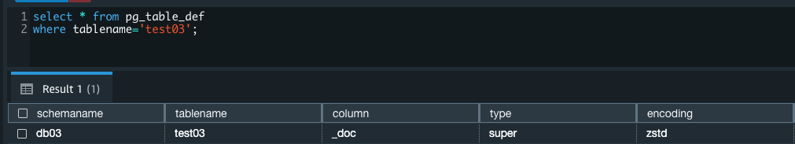


**Data별 Migration Test**

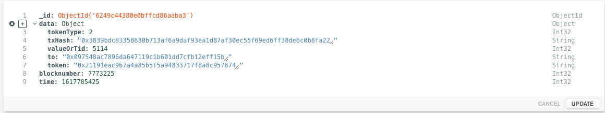


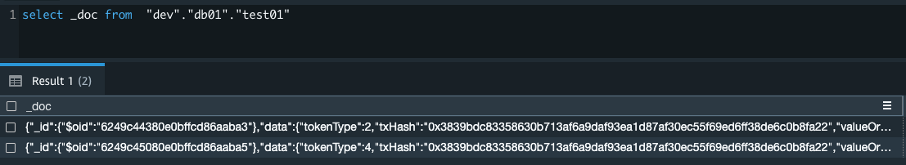

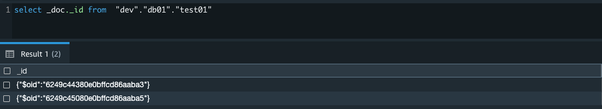

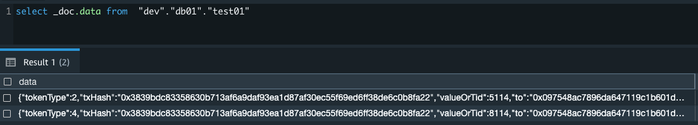

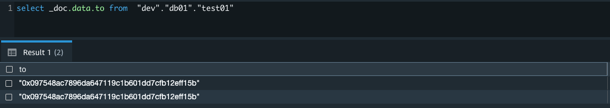

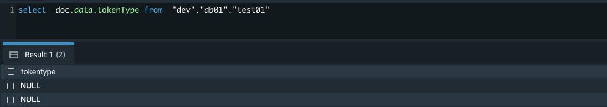


**tokenType을 Int32 => String 변경**

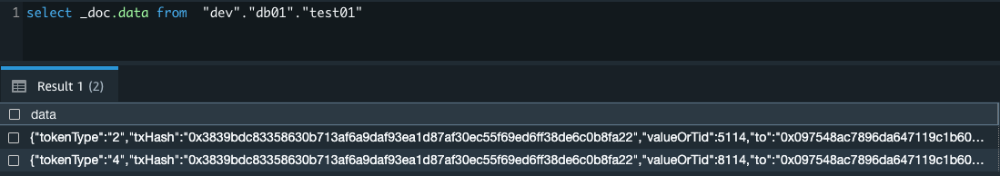

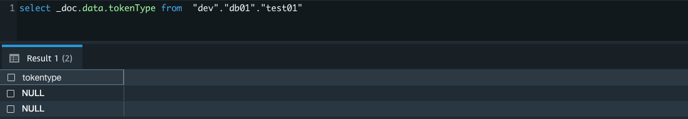


**tokenType, valueOrTid를 모두 Int32 => String 변경 **

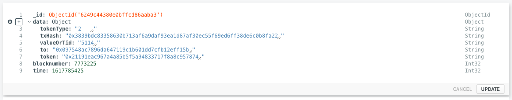

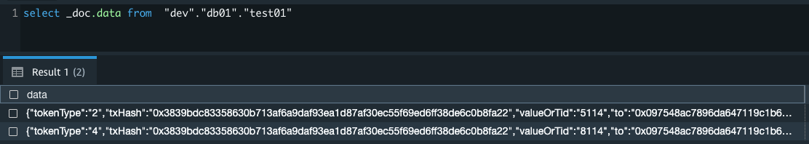

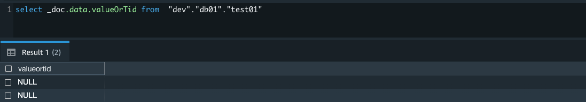


**Mongo 적재부터 모든 Attribute를 String으로 시도**

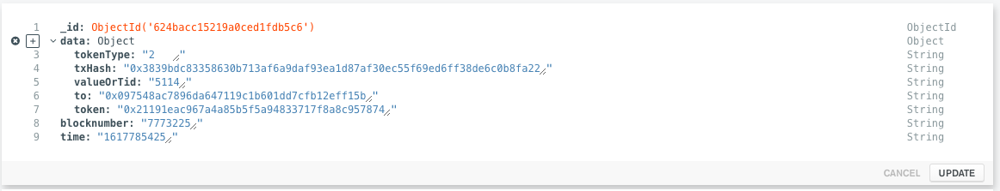


#### MongoDB에서 별도의 Collection으로 사전에 ETL

```

> db.test01.find({})
{ "_id" : ObjectId("6249c44380e0bffcd86aaba3"), "data" : { "tokenType" : "2", "txHash" : "0x3839bdc83358630b713af6a9daf93ea1d87af30ec55f69ed6ff38de6c0b8fa22", "valueOrTid" : "5114", "to" : "0x097548ac7896da647119c1b601dd7cfb12eff15b", "token" : "0x21191eac967a4a85b5f5a94833717f8a8c957874" }, "blocknumber" : 7773225, "time" : 1617785425 }


```


```
db.getSiblingDB("db01").test01.aggregate( [
    { $group : { _id : "$_id", data: { $push: "$data" } } },
    { $out : "test013" }
] )

> db.test013.find({})
{ "_id" : ObjectId("6249c44380e0bffcd86aaba3"), "data" : [ { "tokenType" : "2", "txHash" : "0x3839bdc83358630b713af6a9daf93ea1d87af30ec55f69ed6ff38de6c0b8fa22", "valueOrTid" : "5114", "to" : "0x097548ac7896da647119c1b601dd7cfb12eff15b", "token" : "0x21191eac967a4a85b5f5a94833717f8a8c957874" } ] }

```


```
> db.test01.find({}, {"data.tokenType": 1,"data.tokenType": 1,"data.valueOrTid": 1, "data.to": 1, "data.token": 1})
{ "_id" : ObjectId("6249c44380e0bffcd86aaba3"), "data" : { "tokenType" : "2", "valueOrTid" : "5114", "to" : "0x097548ac7896da647119c1b601dd7cfb12eff15b", "token" : "0x21191eac967a4a85b5f5a94833717f8a8c957874" } }

```


```
대소문자의 경우 double quatation을 쓰면 해결된다고 하는데 테스트는 해보지 않았음

```


